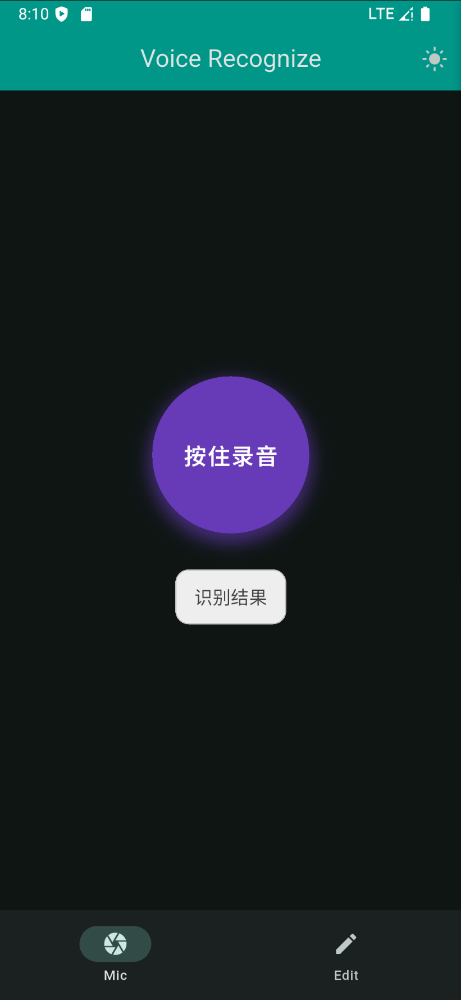
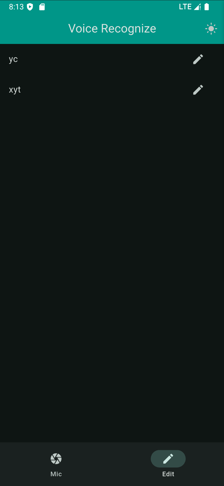
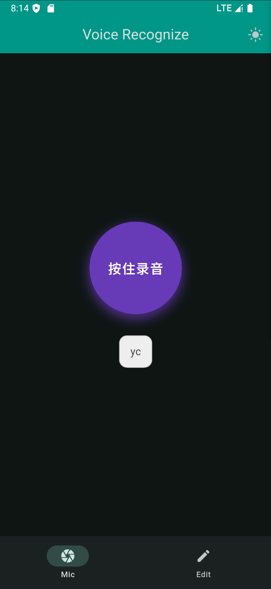

# voice

A voice recg application

<div style="display: flex; gap: 10px;">
  
  
  
</div>


## 实现

### 依赖选择

- 模型导出（.pth -> onxx -> tf -> tflite），使用 Resemblyzer 难以导出，并且推理报错
- 最后采用的模型是 deep-speaker，本身就是用 tf 写的，所以导出的时候很方便，并且这个模型直接把 Mel 的过程也实现了。只需要输入 PCM
- 麦克风使用的是 flutter_sound 库

### 模块划分

核心功能（收集 PCM、模型推理）都集中在 ./lib/views/pages/mic.dart 的 `MicPage`，其中包含：

- `final FlutterSoundRecorder _recorder = FlutterSoundRecorder`：来自 `flutter_sound` 插件来获取 PCM
- `late Interpreter _interpreter;`：来自 `tflite_flutter`，用来加载 `tflite` 并且推理


## 声纹处理流程

1. 利用 `flutter_sound` 插件从麦克风采样 PCM。这里很多细节，在 ./lib/views/pages/mic.dart 的 `_startRecording`。总得来说最后会得到一个 ` List<double> ` 对象。

2. 调用模型：

    ```dart
    _interpreter.run(input, output);
    ```

    这个 deep-speaker 的输入是 PCM，并且长度是固定的，所以如果录音太长会被截断，太短会补充 0。是一个简陋的实现，还需要更多调研。

    ./lib/views/pages/mic.dart `_runModelInference` 函数。


## References

- https://github.com/resemble-ai/Resemblyzer：一个开源声纹识别库
- https://blog.csdn.net/gitblog_01295/article/details/143045366：Resemblyzer 的使用
- https://yf-cheng.com/zh-cn/p/tts-evaluation-targets/
- https://github.com/philipperemy/deep-speaker：一个开源声纹识别库